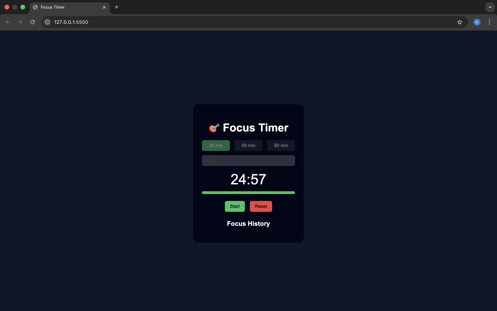

# 🎯 Focus Timer App

A modern **Focus Timer + Task Flow web application** built using **HTML, CSS, and JavaScript**.
This app helps users stay productive by focusing on **one task per session** with a countdown timer and progress tracking.

## ✨ Features
- ⏱ Select focus time (25 / 40 / 60 minutes)
- ✍️ Add a single task for each focus session
- ▶ Start & 🔁 reset timer
- 📊 Visual progress bar during the session
- 🔒 Inputs disabled while timer is running (better UX)
- 🎉 Completion feedback when session ends
- 🧾 Focus history with task, duration, and timestamp
- 💾 Persistent data using `localStorage`
- 📱 Clean, responsive, dark-themed UI

## 🛠️ Technologies Used
- **HTML5** – Structure
- **CSS3** – Styling & Layout
- **JavaScript (ES6)** – Timer logic, DOM manipulation, localStorage

## 📁 Project Structure
focus-timer-app/
│
├── index.html
├── style.css
├── script.js
└── README.md

## 📷 Screenshot
<p align="center">
  
</p>

## 🧠 Learning Outcomes
- Implemented time-based logic using `setInterval`
- Managed UI state during asynchronous operations
- Built a real-world productivity workflow
- Used `localStorage` for persistent data
- Improved UX with visual feedback and input control

## ▶ How to Run Locally
1. Clone the repository:
   ```bash
   git clone https://github.com/<Kavita635>/focus-timer-app.git

## 🚀 Live Demo
🔗 https://kavita635.github.io/focus-timer-app/

